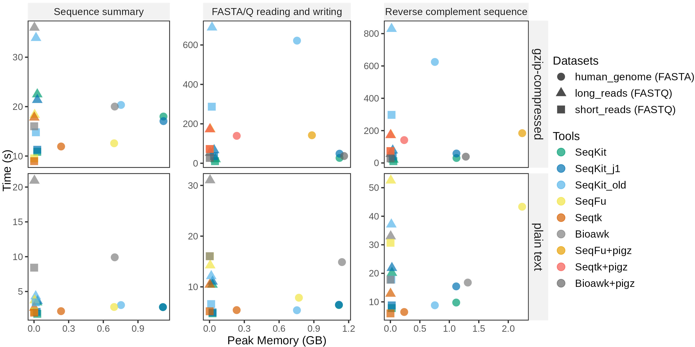

# Benchmark

## Tools

- [seqtk](https://github.com/lh3/seqtk/), version [v1.4](https://github.com/lh3/seqtk/releases/tag/v1.4).
- [seqfu](https://github.com/telatin/seqfu2), version [v1.20.3](https://github.com/telatin/seqfu2/releases/tag/v1.20.3).
- [seqkit](https://github.com/shenwei356/seqkit), version [v2.8.0](https://github.com/shenwei356/seqkit/releases/tag/v2.8.0) and [v0.3.1.1](https://github.com/shenwei356/seqkit/releases/tag/v0.3.1.1).
- [bioawk](https://github.com/lh3/bioawk), commit [fd40150](https://github.com/lh3/bioawk/tree/fd40150b7c557da45e781a999d372abbc634cc21)

Notes:

- `seqfu` and `seqtk` do not support wrapped (fixed line width) outputting, so `seqkit` uses
`-w 0` to disable outputting wrapping.
- `seqtk`, `seqfu` and `bioawk` do not suppport gzip-compressed output, so we pipe the results to `gzip` or [`pigz`](https://zlib.net/pigz/) (a faster gzip).

Script [`memusg`](https://github.com/shenwei356/memusg) is used to assess running time
and peak memory usage.

## Datasets

Datasets:

- Human genome. Human T2T genomes [T2T-CHM13v2.0_genomic](https://ftp.ncbi.nlm.nih.gov/genomes/all/GCA/009/914/755/GCA_009914755.4_T2T-CHM13v2.0/GCA_009914755.4_T2T-CHM13v2.0_genomic.fna.gz).
- ONT reads. Metagenomic reads from a mock community: [ERR5396170](http://ftp.sra.ebi.ac.uk/vol1/fastq/ERR539/000/ERR5396170/ERR5396170.fastq.gz), it is down-sampled for keeping 20 percents reads with `seqkit sample -p 0.2`.
- Illumina reads. Metagenomic reads from a mock community: [SRR8359173](https://ftp.sra.ebi.ac.uk/vol1/fastq/SRR835/003/SRR8359173/). Pair-end reads are merged.

Summary:

    file                       format  type    num_seqs        sum_len  min_len        avg_len      max_len
    human_genome.fasta.gz      FASTA   DNA           25  3,117,292,070   16,569  124,691,682.8  248,387,328
    long_reads.fastq.gz        FASTQ   DNA      543,504  1,797,973,978       90        3,308.1      170,525
    short_reads.fastq.gz       FASTQ   DNA   10,038,314  1,254,789,250      125            125          125

## Benchmarks

Benchmarks and commands:

1. Summary information of FASTA/Q files, including the number of sequences and bases.
    - `seqfu  count $input > $output`, `seqfu count` counts the number of sequences
    - `seqtk   size $input > $output`, `seqtk size` counts the number of sequences and bases
    - `seqkit stats $input > $output`, `seqkit stats` counts the number of sequences and bases and more.
    - `bioawk -c fastx 'END{print NR}' $input > $output`, counts the number of sequences
2. FASTA/Q file reading and writing.
    - For plain text:
        - `seqfu  cat       $input > $output`
        - `seqtk  seq       $input > $output`
        - `seqkit seq -w 0  $input > $output`
        - bioawk
            - fasta: `bioawk -c fastx '{ print ">"$name"\n"$seq }' $input > $output`
            - fastq: `bioawk -c fastx '{ print ">"$name"\n"$seq"\n+\n"$qual}' $input > $output`
    - For gzip-compressed files:
        - `seqfu  cat      $input.gz | pigz -c > $output.gz`
        - `seqtk  seq      $input.gz | pigz -c > $output.gz`
        - `seqkit seq -w 0 $input.gz -o $output.gz`
        - bioawk
            - fasta: `bioawk -c fastx '{ print ">"$name"\n"$seq }' $input.gz | pigz -c > $output.gz`
            - fastq: `bioawk -c fastx '{ print ">"$name"\n"$seq"\n+\n"$qual}' $input.gz | pigz -c > $output.gz`
3. Reverse complementary sequence computation.
    - For plain text:
        - `seqfu  rc             $input > $output`
        - `seqtk  seq -r         $input > $output`
        - `seqkit seq -r -p -w 0 $input > $output`
        - bioawk
            - fasta: `bioawk -c fastx '{ print ">"$name"\n"revcomp($seq) }' $input > $output`
            - fastq: `bioawk -c fastx '{ print ">"$name"\n"revcomp($seq)"\n+\n"reverse($qual)}' $input > $output`
    - For gzip-compressed files:
        - `seqfu  rc             $input.gz | pigz -c > $output.gz`
        - `seqtk  seq -r         $input.gz | pigz -c > $output.gz`
        - `seqkit seq -r -p -w 0 $input.gz -o $output.gz`
        - bioawk
            - fasta: `bioawk -c fastx '{ print ">"$name"\n"revcomp($seq) }' $input | pigz -c > $output.gz`
            - fastq: `bioawk -c fastx '{ print ">"$name"\n"revcomp($seq)"\n+\n"reverse($qual)}' $input | pigz -c > $output.gz`

Tests were repeated 3 times and average time and memory usage were recorded.

Results:

Notes:

- `seqkit` uses 4 threads by default.
- `seqkit_j1` uses 1 thread.
- `seqkit_old` refers to SeqKit v0.3.1.1.
- `seqfu` is single-threaded.
- `seqtk` is single-threaded.
- `bioawk` is single-threaded.
- `seqtk+pigz`: `seqtk` pipes data to the multithreaded `pigz` which uses 4 threads here.
- `seqfu+pigz`: `seqfu` pipes data to the multithreaded `pigz` which uses 4 threads here.
- `bioawk+pigz`: `bioawk` pipes data to the multithreaded `pigz` which uses 4 threads here.
 
## Steps

    # run the benchmarks
    ./run.pl -n 3 run_benchmark_*.sh --outfile benchmark.tsv

    # rename dataset
    # csvtk: https://github.com/shenwei356/csvtk  v0.30.0 or later versions
    cat benchmark.tsv \
        | csvtk replace -t -f dataset -p '\.(fasta)' -r ' (FASTA)' \
        | csvtk replace -t -f dataset -p '\.(fastq)' -r ' (FASTQ)' \
        | csvtk sort -t -L test:order_test.txt -L app:order_app.txt -L dataset:order_data.txt -k test:u -k dataset:u -k app:u \
        > benchmark.filtered.tsv

    # plot
    ./plot.R -i benchmark.filtered.tsv --dpi 600 --width 10 --height 5 -o benchmark.jpg
